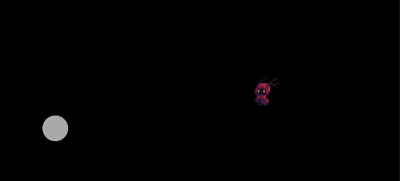

```markdown
# MyHero - Flutter 2D 像素风游戏



## 前言

小时候的我们都有一个小小的游戏梦  
**植物大战僵尸、红警、CF、LOL、王者荣耀** …  
半夜偷偷玩电脑、玩手机，那更是 **基操勿六**  

即使现在长大了，没时间玩了  
💭 但那份 **热爱**，从未消失  

本项目使用 **Flutter + Flame** 制作一款 `2D像素风` 游戏  
所有 **源代码** 与 **素材** 均开源，欢迎学习与改进。

---

## 技术栈与引擎

- **Flutter**: 跨平台 UI + 游戏逻辑
- **Flame**: 轻量级 2D 游戏引擎
- **flame_audio**: 音频播放支持
- **flame_tiled**: 支持 Tiled 地图解析

### Flame 特性

| 功能模块            | 说明                                     |
| ------------------ | -------------------------------------- |
| 组件化系统（FCS）      | 游戏角色、背景、UI 全部组件化，结构清晰、可扩展 |
| 游戏循环（Game Loop） | 内置稳定帧循环，自动处理 `update()` 与 `render()` |
| 动画管理简单          | Sprite / SpriteSheet / SpriteAnimation 使用便捷 |
| 碰撞检测 & 物理支持     | 自带碰撞系统，支持 Shape、Hitbox、物理模拟等 |
| 输入处理统一          | 处理点击、拖拽、多点触控、键盘、手柄等输入 |
| 生态完善            | 丰富扩展插件：flame_audio、flame_behaviors、flame_rive、flame_forge2d 等 |

### 素材获取推荐

1. **[itch.io](https://itch.io)**  
   - 大量独立游戏素材：像素人物、地图、音效、UI  
   - 支持免费/付费/随心付方式下载  

2. **[Holopix AI](https://holopix.cn)**  
   - AI 生成游戏美术素材  
   - 支持 2D → 3D 转换、局部精修、风格一致性  

---

## 项目结构

```

lib/
├── main.dart          // 游戏入口
├── game/
│   ├── my_game.dart   // 游戏核心逻辑
│   ├── component/     // 游戏组件（玩家、敌人、道具）
│   └── state/         // 组件状态逻辑（Idle/Run/Attack/Die 等）
assets/
└── images/            // 游戏图片资源（精灵图等）

````

---

## 安装依赖

在 `pubspec.yaml` 中添加：

```yaml
dependencies:
  flame: ^1.34.0
  flame_audio: ^2.11.12
  flame_tiled: ^1.17.0
````

---

## 游戏核心实现

### main.dart

```dart
import 'package:flutter/material.dart';
import 'game/my_game.dart';
import 'package:flame/game.dart';

void main() {
  runApp(
    GameWidget(
      game: MyGame(),
    ),
  );
}
```

### my_game.dart

```dart
import 'package:flame/game.dart';
import 'package:flutter/material.dart';

class MyGame extends FlameGame {
  @override
  Future<void> onLoad() async {
    super.onLoad();
  }

  @override
  void update(double dt) {
    super.update(dt);
  }

  @override
  void render(Canvas canvas) {
    super.render(canvas);
  }
}
```

---

## HeroComponent - 玩家角色

### 特性

* 继承 `SpriteAnimationComponent`，支持动画播放
* 支持动画状态切换（Idle/Run/Attack）
* 根据摇杆方向自动翻转朝向

### 示例代码

```dart
class HeroComponent extends SpriteAnimationComponent with HasGameReference<MyGame> {
  HeroComponent() : super(size: Vector2(32, 32), anchor: Anchor.center);

  @override
  Future<void> onLoad() async {
    final image = await game.images.load('SPRITE_SHEET.png');
    final sheet = SpriteSheet(image: image, srcSize: Vector2(32, 32));

    animation = sheet.createAnimation(row: 0, stepTime: 0.15, from: 0, to: 5, loop: true);

    size = Vector2(100, 100);
    position = game.size / 2;
  }

  @override
  void onGameResize(Vector2 size) {
    super.onGameResize(size);
    position = size / 2;
  }
}
```

---

## 移动与动画控制

### 1. 使用虚拟摇杆

```dart
joystick = JoystickComponent(
  knob: CircleComponent(radius: 30, paint: Paint()..color = Colors.white70),
  background: CircleComponent(radius: 80, paint: Paint()..color = Colors.black87),
  margin: const EdgeInsets.only(left: 50, bottom: 50),
);
```

### 2. 根据状态切换动画

```dart
enum HeroState { idle, run, swim, attack, hurt, die }

void _setState(HeroState newState) {
  if (state == newState) return;
  state = newState;
  animation = animations[state]!;
}
```

### 3. 左右翻转角色

```dart
bool facingRight = true;

void _faceRight() { if (!facingRight) { flipHorizontally(); facingRight = true; } }
void _faceLeft() { if (facingRight) { flipHorizontally(); facingRight = false; } }

if (joy.relativeDelta.x > 0) _faceRight();
else if (joy.relativeDelta.x < 0) _faceLeft();
```

---

## 项目目标

* 构建一款完整的 2D 像素风游戏
* 使用 Flutter + Flame 技术栈，实现跨平台开发
* 支持玩家控制、动画状态切换与方向翻转
* 提供基础框架，方便扩展敌人、道具、技能系统等

---

## 开源协议

MIT License

---

## 资源 & 链接

* [精灵图资源 - 塞提尔](https://lucky-loops.itch.io/character-satyr)
* [itch.io](https://itch.io)
* [Holopix AI](https://holopix.cn)

```

